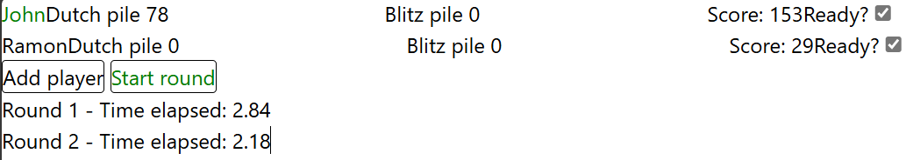

# Dutch Blitz Scoresheet
A simple, mobile-first web application built with Svelte to keep track of player scores in a game of [Dutch Blitz](https://dutchblitz.com/). It's currently functional but only works on desktop because I'm not deploying it until I've fixed up the design and made it responsive.

## Upcoming release
The upcoming release will be **v0.3** which will mostly be an overhaul of the codebase since I kinda just patched things up as I went in an effort to get it working ASAP - good in the short term but it means that it's getting harder to make changes now without breaking something.

I will also implement unit testing just for the sake of learning it too.

## Change Log
### 0.2.0 - 2025-06-01
This is the v0.2 release which contains *mostly* functional upgrades and bug fixes: such as a section to keep track of how much time elapsed in previous rounds; highlighting the winner's name in green; checkboxes to determine if a player is ready and warnings to show the game master if not everyone is ready and a round is attempted to be started.

It's still ugly, but it's working.

I've noted that there are still **some issues**:

-  The time elapsed in the round history is still showing seconds rather than minutes:seconds:millseconds
- If there are multiple winners, the alert is shown as soon as the last player is marked ready and therefore, if the last player is a winner, they're not included in the list
- The score can be edited while a player is ready, but they need to be unticked and then ticked to recalculate the score




## How to run it
```bash
bun run dev --open # Will open in your default browser
```